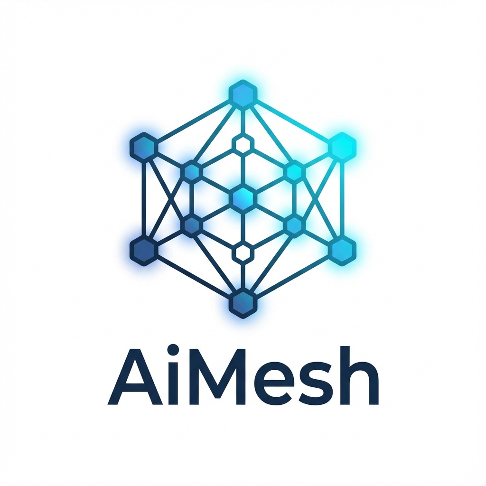

<p align="center">
  
</p>

<h1 align="center">AiMesh</h1>

<p align="center">
  <strong>High-Performance AI Agent Message Queue with Cost-Aware Routing</strong>
</p>

<p align="center">
  <a href="#features">Features</a> •
  <a href="#architecture">Architecture</a> •
  <a href="#quick-start">Quick Start</a> •
  <a href="#sdks">SDKs</a> •
  <a href="#documentation">Documentation</a> •
  <a href="#contributing">Contributing</a>
</p>

<p align="center">
  
  
  
</p>

---

## Overview

AiMesh is a production-ready, high-performance message queue specifically designed for AI agent orchestration. Built in Rust for maximum performance and reliability, it provides intelligent routing based on cost, latency, and load with built-in budget enforcement and semantic deduplication.

**Target Performance:** 5M+ messages/second with sub-millisecond P99 latency

## Features

| Category | Capabilities |
|----------|--------------|
| **Intelligent Routing** | Cost-aware endpoint selection, multi-factor scoring (cost × 0.4 + load × 0.3 + latency × 0.3), automatic failover |
| **Budget Management** | Per-agent token budgets, real-time enforcement, consumption tracking |
| **Performance** | QUIC transport with TLS 1.3, connection pooling, zero-copy message handling |
| **Deduplication** | Blake3 semantic hashing, configurable TTL, in-memory caching |
| **Orchestration** | Scatter-gather workflows, dependency resolution, task graph execution |
| **Multi-tenancy** | Tier-based quotas (Free/Starter/Pro/Enterprise), tenant isolation |
| **Rate Limiting** | Token bucket + sliding window, per-key and global limits |
| **Observability** | Prometheus metrics, P50/P99/P99.9 latency tracking, health checks |
| **Global Scale** | Multi-region federation, geo-routing, latency-based routing |

## Architecture

```
┌─────────────────────────────────────────────────────────────────────────┐
│                              AiMesh Core                                 │
├──────────────┬──────────────┬──────────────┬──────────────┬─────────────┤
│   Protocol   │    Router    │   Storage    │ Orchestrator │  Transport  │
│  (Protobuf)  │ (Cost-Aware) │  (Barq-DB)   │  (Scatter)   │   (QUIC)    │
├──────────────┴──────────────┴──────────────┴──────────────┴─────────────┤
│                          Enterprise Layer                                │
├──────────────┬──────────────┬──────────────┬──────────────┬─────────────┤
│ Rate Limiter │ Multi-Tenant │   Priority   │   Metrics    │  Federation │
│(Token Bucket)│   (Quotas)   │   (Queue)    │ (Prometheus) │ (Geo-Route) │
├──────────────┴──────────────┴──────────────┴──────────────┴─────────────┤
│                          Storage Backend                                 │
│  ┌───────────────────────────┐  ┌───────────────────────────────────┐   │
│  │         Barq-DB           │  │          Barq-GraphDB             │   │
│  │    (Vector Database)      │  │     (Graph Relationships)         │   │
│  │  • Message storage        │  │  • Agent relationships            │   │
│  │  • Semantic search        │  │  • Task dependencies              │   │
│  │  • Dedup cache            │  │  • Hybrid queries                 │   │
│  └───────────────────────────┘  └───────────────────────────────────┘   │
└─────────────────────────────────────────────────────────────────────────┘
```

## Quick Start

### Prerequisites

Start the storage backends:

```bash
# Barq-DB (Vector Database)
docker run -p 8080:8080 yasserrmd/barq-db

# Barq-GraphDB (Graph Database)
docker run -p 8081:8081 -p 50052:50052 yasserrmd/barq-graphdb
```

### Installation

```bash
git clone https://github.com/YASSERRMD/AiMesh.git
cd AiMesh
cargo build --release
cargo run --release
```

### Basic Usage

```rust
use aimesh::{AiMesh, AiMeshConfig, AiMessage, EndpointMetrics, HealthStatus};

#[tokio::main]
async fn main() -> anyhow::Result<()> {
    // Initialize AiMesh
    let mesh = AiMesh::new(AiMeshConfig::default())?;
    
    // Register AI model endpoints
    mesh.router.register_endpoint(EndpointMetrics {
        endpoint_id: "gpt-4".into(),
        capacity: 1000,
        current_load: 0,
        cost_per_1k_tokens: 30.0,
        latency_p99_ms: 500.0,
        error_rate: 0.01,
        last_health_check: 0,
        health_status: HealthStatus::Healthy as i32,
    });
    
    // Configure agent budget (10,000 tokens)
    mesh.router.set_budget("my-agent", 10000.0, i64::MAX);
    
    // Process messages
    let message = AiMessage::new(
        "my-agent".into(),
        b"Summarize this document...".to_vec(),
        1000.0,
        i64::MAX,
    );
    
    let ack = mesh.process_message(message).await?;
    println!("Processed in {}ms, tokens used: {}", 
             ack.processing_latency_ms, ack.tokens_used);
    
    Ok(())
}
```

## SDKs

Official client libraries for multiple languages:

| Language | Package | Installation |
|----------|---------|--------------|
| **Python** | `aimesh` | `pip install aimesh` |
| **Node.js** | `@aimesh/sdk` | `npm install @aimesh/sdk` |
| **Go** | `aimesh` | `go get github.com/YASSERRMD/AiMesh/sdk/go` |

### Python Example

```python
from aimesh import AiMeshClient, Message

client = AiMeshClient("http://localhost:9000")
ack = client.send_message(Message(
    agent_id="my-agent",
    payload=b"Hello, AI!",
    priority=50,
))
print(f"Processed in {ack.processing_latency_ms}ms")
```

### Node.js Example

```typescript
import { AiMeshClient } from '@aimesh/sdk';

const client = new AiMeshClient({ baseUrl: 'http://localhost:9000' });
const ack = await client.sendMessage({
    agentId: 'my-agent',
    payload: Buffer.from('Hello, AI!'),
});
console.log(`Processed in ${ack.processingLatencyMs}ms`);
```

## Configuration

| Environment Variable | Default | Description |
|---------------------|---------|-------------|
| `AIMESH_BIND_ADDR` | `0.0.0.0:9000` | Server bind address |
| `BARQ_DB_URL` | `http://localhost:8080` | Barq-DB endpoint |
| `BARQ_GRAPHDB_URL` | `http://localhost:8081` | Barq-GraphDB endpoint |
| `AIMESH_RATE_LIMIT_RPS` | `100` | Requests per second limit |
| `AIMESH_DEDUP_TTL` | `3600` | Deduplication cache TTL (seconds) |

## Routing Algorithm

The cost-aware router uses a multi-factor scoring system:

```
score = (cost × 0.4) + (load × 0.3) + (latency × 0.3)
```

**Routing Flow:**
1. Validate agent budget
2. Apply rate limiting
3. Check deduplication cache
4. Filter healthy endpoints
5. Score all available endpoints
6. Select optimal endpoint (lowest score)
7. Build fallback chain for resilience

## Documentation

- [Protocol Specification](docs/PROTOCOL.md) - Message types and wire format
- [API Examples](examples/messages.json) - Sample request/response payloads
- [Python SDK](sdk/python/README.md) - Python client documentation
- [Node.js SDK](sdk/nodejs/README.md) - Node.js client documentation
- [Go SDK](sdk/go/README.md) - Go client documentation

## Benchmarks

```bash
cargo bench
```

## Testing

```bash
# Run all tests
cargo test

# Run with verbose output
cargo test -- --nocapture
```

## Project Roadmap

- [x] Phase 1: Core Infrastructure (Protocol, Routing, Storage, Transport)
- [x] Phase 2: Enterprise Features (Rate Limiting, Multi-tenancy, Priority Queue)
- [x] Phase 3: SDKs (Python, Node.js, Go)
- [x] Phase 4: Global Scale (Federation, Geo-routing)
- [ ] Phase 5: Advanced Features (ML-based routing, Auto-scaling)

## Contributing

We welcome contributions from the community. Please read our [Contributing Guide](CONTRIBUTING.md) before submitting a pull request.

**Ways to Contribute:**
- Report bugs and request features via [GitHub Issues](https://github.com/YASSERRMD/AiMesh/issues)
- Submit pull requests for bug fixes and new features
- Improve documentation
- Share feedback and ideas

## Storage Backends

AiMesh integrates with the Barq ecosystem:

- **[Barq-DB](https://github.com/YASSERRMD/barq-db)** - Rust-based vector database with BM25 + vector hybrid search
- **[Barq-GraphDB](https://github.com/YASSERRMD/barq-graphdb)** - Production-ready hybrid Graph+Vector DB for agentic AI

## License

This project is licensed under the MIT License. See the [LICENSE](LICENSE) file for details.

## Author

**YASSERRMD** - [GitHub](https://github.com/YASSERRMD)

---

<p align="center">
  Built with Rust for maximum performance and reliability
</p>
